# Connecting an ESP32 to an Android App via BLE (Bluetooth Low Energy): Let Meowt Door opening solution when the user comes close to the door
### **Manual for IoT Solution: Connecting a BLE ESP32 to an Android App**

## Table of Contents
1. [Introduction](#introduction)
2. [Prerequisites](#prerequisites)
   - [Hardware](#hardware)
   - [Software](#software)
   - [Knowledge Requirements](#knowledge-requirements)
3. [Setting Up the Arduino IDE for ESP32](#step-1-setting-up-the-arduino-ide-for-esp32)
4. [Understanding and writing the ESP32 Code](#step-2-understanding-and-writing-the-esp32-code)
5. [Setting Up the Android App](#step-3-setting-up-the-android-app)
6. [integrating BLE connection and command sending in the app](#4-integrating-ble-connection-and-command-sending-in-the-app-android-studio)
7. [Testing](#step-6-testing-and-troubleshooting)
8. [Troubleshooting](#Troubleshooting-Guide)
   - [ESP32 Not Connecting via BLE](#esp32-not-connecting-via-ble)
   - [No BLE Devices Found During Scan](#no-ble-devices-found-during-scan)
   - [Android App Crashes on Startup](#android-app-crashes-on-startup)
   - [Commands Not Executing on ESP32](#commands-not-executing-on-esp32)
   - [BLE Connection is Dropping](#ble-connection-is-dropping)
   - [ESP32 Not Responding to Android Commands](#esp32-not-responding-to-android-commands)
   - [Bluetooth Permissions Issues on Android](#bluetooth-permissions-issues-on-android)

---

## **Introduction**

This detailed guide will walk you through the process of building an IoT system using an ESP32 microcontroller with Bluetooth Low Energy (BLE) capabilities, and an Android app to control it. This system can be used to perform tasks like opening or locking a door remotely when in close proximity. This manual is designed for users with basic coding knowledge, and it not only provides step-by-step instructions but also explains why each step is necessary, ensuring a deeper understanding of the project.

---
## **Prerequisites**

Before you begin building the **Let Meowt Door Opening Solution**, ensure you have the following hardware, software, and resources in place. This project combines ESP32 microcontroller programming with Android app development, so you’ll need tools for both platforms.

### **Hardware**

1. **ESP32 Microcontroller**
   - You’ll need an ESP32 board with Bluetooth Low Energy (BLE) capabilities. ESP32 Dev Kits are widely available, such as the ESP32 Dev Module or similar models.
   
2. **USB Cable**
   - A USB cable (usually Micro-USB) to connect your ESP32 board to your computer for uploading code.

3. **Android Smartphone**
   - An Android smartphone running **Android 5.0 (Lollipop)** or above. This phone will be used to run the custom Android app you’ll develop, which will communicate with the ESP32 via BLE.

4. **Power Supply for the ESP32**
   - A 5V power supply to power your ESP32 when it’s deployed. If you’re testing, the ESP32 can be powered via USB.

5. **Door Mechanism (Optional)**
   - If you want to physically control a door, you will need additional hardware such as:
     - **Servo Motor** or **Relay Module**: To control the locking mechanism.
     - **Power source** and necessary connectors for the motor or relay.
     - A door lock mechanism, if you plan to automate an actual door.

### **Software**

1. **Arduino IDE**
   - Download and install the Arduino IDE to write and upload code to your ESP32. This is available for Windows, macOS, and Linux platforms.  
   [Download Arduino IDE](https://www.arduino.cc/en/software)

2. **ESP32 Board Support for Arduino IDE**
   - You will need to install the ESP32 board package in the Arduino IDE to program the ESP32. Instructions for setting this up are provided in the "Setting Up the Arduino IDE" section.

3. **Android Studio**
   - Install Android Studio, which is required to build and run the Android app on your smartphone.  
   [Download Android Studio](https://developer.android.com/studio)

4. **Bluetooth LE-capable Android Phone**
   - Ensure your Android device supports Bluetooth Low Energy (BLE), which is required for communicating with the ESP32.

5. **Serial Monitor Tool (Optional)**
   - A tool for debugging the ESP32 via USB, such as the Serial Monitor integrated within the Arduino IDE.

### **Knowledge Requirements**

1. **Basic Programming Knowledge**
   - Familiarity with Arduino programming (C/C++) is recommended. You should be comfortable with writing or modifying Arduino sketches to control the ESP32.
   - Basic understanding of Android development in **Kotlin** or **Java** is required to create the Android app and implement BLE functionality.

2. **Bluetooth Low Energy (BLE) Basics**
   - A general understanding of BLE communication (how devices discover, connect, and exchange data) will be useful but not strictly necessary. This guide explains key concepts in detail.

3. **Wiring and Electronics (Optional)**
   - If you plan to connect your ESP32 to physical hardware like servos or relays to open/close a door, you’ll need to know how to wire these components properly.

### **Libraries and Dependencies**

1. **ESP32 BLE Arduino Library**
   - This library provides BLE support for the ESP32. It should be installed via the Arduino IDE’s Library Manager.
   Instructions for installing this library will be provided in the **Arduino IDE Setup** section.

2. **Kotlin for Android Studio**
   - The Android app will be written in **Kotlin**, so ensure that Kotlin is set up in Android Studio. This is usually pre-configured, but you can verify by going to **File** > **Project Structure** > **Modules** and checking the language settings.

---

### **Step 1: Setting Up the Arduino IDE for ESP32**

Before we can start programming the ESP32, we need to ensure that the development environment is correctly set up. Here’s how to configure the Arduino IDE to work with ESP32:

#### **1.1 Install Arduino IDE**

First, if you haven't installed the Arduino IDE, follow these steps:

1. Go to the [official Arduino website](https://www.arduino.cc/en/software) and download the latest version of the Arduino IDE for your operating system.
2. Install the IDE by following the instructions for your specific operating system.

#### **1.2 Set Up ESP32 Board Support**

The ESP32 is not supported by Arduino by default, so we need to add support for it.

1. Open the Arduino IDE.
2. In the top menu, go to **File** > **Preferences**. This will open the preferences window.
3. In the field labeled **Additional Board Manager URLs**, add the following URL:  
   [https://dl.espressif.com/dl/package_esp32_index.json](http://arduino.esp8266.com/stable/package_esp8266com_index.json)
   
   This URL tells the Arduino IDE where to find the package needed to program ESP32 devices.

   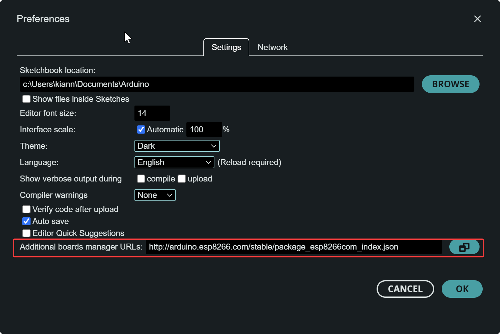

4. After adding the URL, click **OK** to close the window.

#### **1.3 Install the ESP32 Board Package**

Next, we need to download and install the actual board files for ESP32.

1. Go to **Tools** > **Board** > **Boards Manager**.  
   This opens the board manager, where you can search and install new boards.
   
   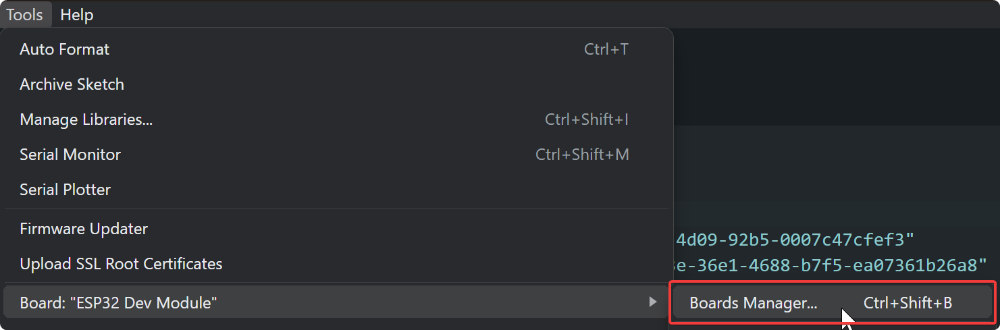

2. In the Boards Manager window, type "ESP32" into the search bar.
3. Select the "ESP32 by Espressif Systems" entry and click **Install**.

   This process will download the necessary files to support ESP32 in the Arduino IDE.

#### **1.4 Select Your ESP32 Board**

Once the ESP32 package is installed, you’ll need to select the correct board for your project.

1. Go to **Tools** > **Board**.
2. Scroll through the list until you find **ESP32 Dev Module** (or your specific ESP32 model). Select it.

> **Why This Step?**  
> This ensures that the Arduino IDE knows how to compile and upload code for your ESP32. Without selecting the correct board, the code would not upload or function properly.

---

### **Step 2: Understanding and writing the ESP32 Code**

The code running on the ESP32 is critical for establishing the BLE communication between the microcontroller and the Android app. This section breaks down the important parts of the **Server.ino** code and explains what each function does, and why it's necessary.

#### **2.0 using the exiting BLE server code**

To not have to write everything manually we are going to be using an existing sketch and modifiying it to make it work with our android app we are yet to make

1. Go to **File** > **Examples** > **BLE** > **Server** this will load the "Server.ino" example file with all the code for our ESP32 to work as an BLE server and be detectable for other devices

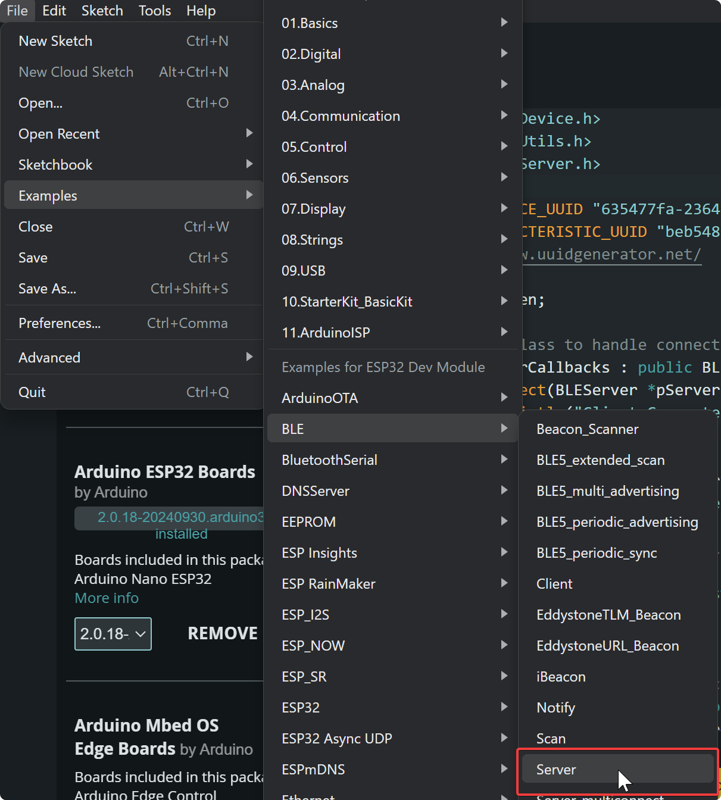

#### **2.1 Setting Up the BLE Server (Server.ino)**

The ESP32 acts as a BLE server, allowing the Android app to connect to it and send commands. Here’s how the BLE server is initialized in the **setup()** function:

```cpp
void setup() {
   Serial.begin(115200); // Initialize Serial communication
  Serial.println("Starting BLE work!");

  BLEDevice::init("Let_Meowt_Door"); // Name of our device
  BLEServer *pServer = BLEDevice::createServer(); // Create a BLE server object
  pServer->setCallbacks(new MyServerCallbacks()); // Set connection callbacks
  BLEService *pService = pServer->createService(SERVICE_UUID); // Creates a refrence to the service 

  // More initialization code follows...
}
```

- **BLEDevice::init("ESP32_Door_Lock")**: This function initializes the BLE functionality on the ESP32 and sets the BLE device name as "Let_Meowt_Door". This name will appear in the list of available BLE devices on the Android app. It is important to note that this name should not be left empty. most systems discard any devices with no name so you won't be able to find it.

- **BLEServer**: This object represents the BLE server on the ESP32. The Android app will connect to this server to send and receive data.

> **Why This Step?**  
> The BLE server is the backbone of communication between the ESP32 and the Android app. Without this server running, the app cannot detect or communicate with the ESP32. Setting the BLE name ensures that the app can identify which device to connect to.

#### **2.2 Creating BLE Services and Characteristics**

BLE communication uses services and characteristics. A service is a collection of data (or characteristics) that the client (Android app) can interact with.

```cpp
  // Create a characteristic and set its properties
    BLECharacteristic *pCharacteristic =
      pService->createCharacteristic(CHARACTERISTIC_UUID,
                                    BLECharacteristic::PROPERTY_READ | BLECharacteristic::PROPERTY_WRITE);

  pCharacteristic->setCallbacks(new MyCharacteristicCallbacks());  // Set write callbacks
  pService->start();
```

- **BLEService**: This object defines a service that groups related characteristics. In this example, `SERVICE_UUID` uniquely identifies the service, which could be something like controlling a door lock.

- **BLECharacteristic**: Characteristics are the actual pieces of data that are exchanged between the server (ESP32) and client (Android app). In this case, we define a characteristic with the ability to be both read and written to by the client.

> **Why This Step?**  
> Defining services and characteristics allows the app to read from and send commands to the ESP32. For example, a characteristic could represent the state of the door (locked or unlocked), and the Android app could write to this characteristic to lock or unlock the door.

#### **2.3 Handling Door Commands**

In the code, specific functions are defined to handle the user commands for opening or locking the door. These commands are sent from the Android app to the ESP32.

```cpp
// Custom characteristic callback class to handle write events
class MyCharacteristicCallbacks : public BLECharacteristicCallbacks {
  void onWrite(BLECharacteristic *pCharacteristic) {
    String value = pCharacteristic->getValue();      // Get the value sent by the client
    Serial.printf("Received: %s\n", value.c_str());  // Print the received value to Serial Monitor

    // You can add your logic here to handle the received data
    // For example, you can parse the value and respond accordingly
    if(value == "Open") {
      isDoorOpen = true;
      openDoor();
      Serial.println("Door is now open.");
    }

    if(value == "Close") {
      isDoorOpen = false;
      closeDoor();
      Serial.println("Door is now closed.");
    }

    Serial.println(isDoorOpen);
  }
};

void openDoor(){
  // Add functionality for controlling a servo to open the door
}

void closeDoor(){
  // Add functionality for controlling a servo to close the door
}
```

- **openDoor()**: This function is called when the app sends a command to unlock or open the door. Depending on your setup, this could involve controlling a motor or releasing a latch.
  
- **lockDoor()**: This function is called when the app sends a command to lock the door. Again, this would control the hardware responsible for securing the door.

> **Why This Step?**  
> These functions handle the core functionality of your IoT solution—controlling the physical door. The app sends a signal, and these functions trigger the relevant hardware to lock or unlock the door.

#### **2.4 Summary**

Your code should now look something like this

```cpp
#include <BLEDevice.h>
#include <BLEUtils.h>
#include <BLEServer.h>

#define SERVICE_UUID "635477fa-2364-4d09-92b5-0007c47cfef3"
#define CHARACTERISTIC_UUID "beb5483e-36e1-4688-b7f5-ea07361b26a8"
// https://www.uuidgenerator.net/

bool isDoorOpen;

// Callback class to handle connection events
class MyServerCallbacks : public BLEServerCallbacks {
  void onConnect(BLEServer *pServer) {
    Serial.println("Client Connected");
  }

  void onDisconnect(BLEServer *pServer) {
    Serial.println("Client Disconnected");
    
    // Restart advertising to be discoverable again
    BLEDevice::startAdvertising();
    Serial.println("Advertising restarted, now discoverable.");
  }
};

// Custom characteristic callback class to handle write events
class MyCharacteristicCallbacks : public BLECharacteristicCallbacks {
  void onWrite(BLECharacteristic *pCharacteristic) {
    String value = pCharacteristic->getValue();      // Get the value sent by the client
    Serial.printf("Received: %s\n", value.c_str());  // Print the received value to Serial Monitor

    // You can add your logic here to handle the received data
    // For example, you can parse the value and respond accordingly
    if(value == "Open") {
      isDoorOpen = true;
      openDoor();
      Serial.println("Door is now open.");
    }

    if(value == "Close") {
      isDoorOpen = false;
      closeDoor();
      Serial.println("Door is now closed.");
    }

    Serial.println(isDoorOpen);
  }
};

void openDoor(){
  // Add functionality for controlling a servo to open the door
}

void closeDoor(){
  // Add functionality for controlling a servo to close the door
}

void setup() {
  Serial.begin(115200); // Initialize Serial communication
  Serial.println("Starting BLE work!");

  BLEDevice::init("Let Meowt Door"); // Name of our device
  BLEServer *pServer = BLEDevice::createServer(); // Create a BLE server object
  pServer->setCallbacks(new MyServerCallbacks()); // Set connection callbacks
  BLEService *pService = pServer->createService(SERVICE_UUID); // Creates a refrence to the service 

    // Create a characteristic and set its properties
    BLECharacteristic *pCharacteristic =
      pService->createCharacteristic(CHARACTERISTIC_UUID,
                                    BLECharacteristic::PROPERTY_READ | BLECharacteristic::PROPERTY_WRITE);

  pCharacteristic->setValue("Hello World says Neil");
  pCharacteristic->setCallbacks(new MyCharacteristicCallbacks());  // Set write callbacks
  pService->start();

  BLEAdvertising *pAdvertising = BLEDevice::getAdvertising();
  pAdvertising->addServiceUUID(SERVICE_UUID);
  pAdvertising->setScanResponse(true);
  pAdvertising->setMinPreferred(0x06);
  pAdvertising->setMinPreferred(0x12);
  BLEDevice::startAdvertising();
  Serial.println("Characteristic defined! Now you can read it in your phone!");
}

void loop() {
  delay(2000);  // Just delay for demonstration
}
```

---
## **Step 3: Setting Up the Android App**

In this section, we will go over how to set up an Android app in Android Studio that will serve as the interface to communicate with the ESP32 via Bluetooth Low Energy (BLE). This app will allow users to scan for BLE devices, connect to the ESP32, and send commands to open or close the door.

### **3.1 Creating a New Android Project in Android Studio**

Before diving into the code, let’s start by creating a new project in Android Studio.

#### **Step 3.1.1: Open Android Studio**

1. Launch **Android Studio** on your computer.
   
   If you haven’t installed it yet, you can download it from [here](https://developer.android.com/studio).

#### **Step 3.1.2: Create a New Project**

1. On the welcome screen, click on **New Project**.

   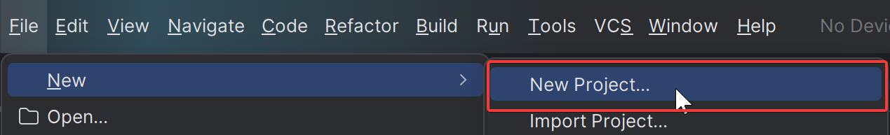

#### **Step 3.1.3: Select an Empty Activity**

1. In the **Select a Project Template** window, choose **Empty Activity**.  
   This creates a basic project with a single screen (activity) where we’ll build the app’s functionality.
   
   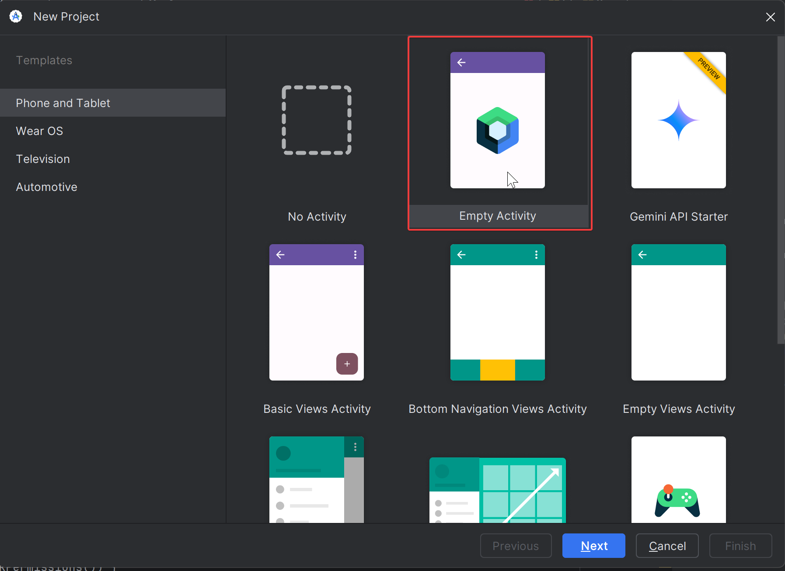

2. Click **Next** to proceed.

#### **Step 3.1.4: Configure Your Project**

1. On the **Configure Your Project** screen, enter the following details:
   - **Name**: `LetMeowtApp`  
     This will be the name of your project and the resulting Android app.
   - **Package Name**: This is automatically generated but can be changed to match your organization (e.g., `com.example.letmeowtapp`).
   - **Save Location**: Choose a directory where you want to store your project files.
   - **Language**: Select **Kotlin** (preferred for modern Android apps).
   - **Minimum API Level**: Select **API 21: Android 5.0 (Lollipop)** or higher to ensure BLE support.

   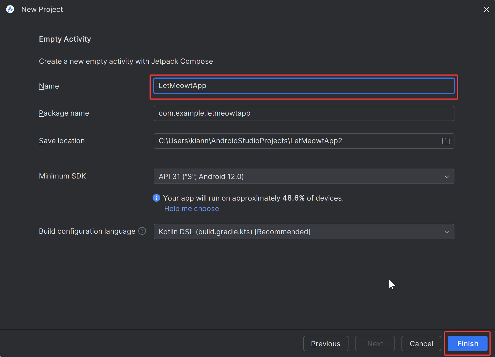

2. Click **Finish** to create your new project.

Android Studio will now create an empty project with the basic structure for an Android app.

---

### **3.2 Exploring the Project Structure**

After the project is created, Android Studio will generate several files and folders for you. Here are the key components of the project:

1. **MainActivity.kt**  
   Located under `app > java > com.example.letmeowtapp`. This file is the entry point of your app, where you will add the logic to scan for BLE devices, connect to the ESP32, and send commands.

2. **activity_main.xml**  
   Located under `app > res > layout`. This XML file defines the layout of the main screen of your app. Here, you will define buttons and views to display devices and interact with the ESP32.

---

### **3.3 Setting Up the User Interface (UI)**

We will now modify the `activity_main.xml` file to include buttons and a RecyclerView that will allow users to scan for and select BLE devices.

#### **Modifying `activity_main.xml`**

Open the **activity_main.xml** file in Android Studio’s layout editor.

1. Replace the existing layout with the following XML code to set up a button for scanning devices and a list (RecyclerView) to display the discovered BLE devices:

```xml
<LinearLayout
    xmlns:android="http://schemas.android.com/apk/res/android"
    android:layout_width="match_parent"
    android:layout_height="match_parent"
    android:orientation="vertical"
    android:padding="16dp">

    <!-- Scan Button -->
    <Button
        android:id="@+id/btnScan"
        android:layout_width="wrap_content"
        android:layout_height="wrap_content"
        android:text="Scan for BLE Devices" />

    <!-- RecyclerView for listing BLE devices -->
    <androidx.recyclerview.widget.RecyclerView
        android:id="@+id/rvDevices"
        android:layout_width="match_parent"
        android:layout_height="wrap_content"
        android:layout_weight="1" />

</LinearLayout>
```

- **Button**: This is the scan button that the user will press to initiate the BLE device scan.
- **RecyclerView**: This is where the list of discovered BLE devices will be displayed after scanning.

> **Why This Step?**  
> The user interface is crucial to making the app interactive. Buttons like "Scan for BLE Devices" and the list of available devices allow users to interact with the ESP32 easily.

The UI should now look something like this

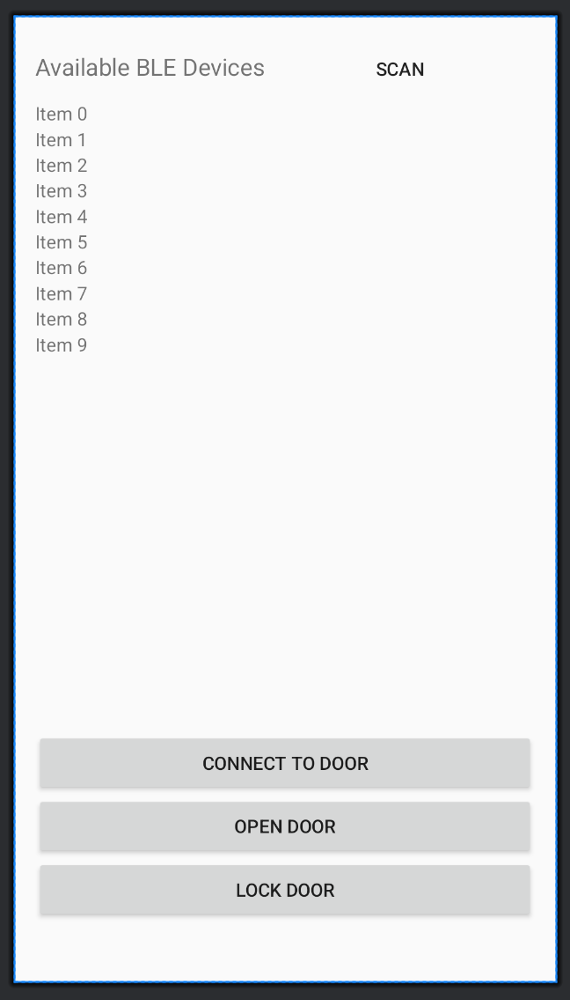

---

### **3.4 Adding BLE Permissions**

To interact with Bluetooth, the app needs the proper permissions. These permissions must be declared in the **AndroidManifest.xml** file.

1. Open the **AndroidManifest.xml** file located under `app > manifests`.

2. Add the following permissions to the file just above the `<application>` tag:

```xml
<uses-permission android:name="android.permission.BLUETOOTH" />
<uses-permission android:name="android.permission.BLUETOOTH_ADMIN" />
<uses-permission android:name="android.permission.ACCESS_FINE_LOCATION" />
```

- **BLUETOOTH**: Required for using basic Bluetooth features.
- **BLUETOOTH_ADMIN**: Allows the app to initiate device discovery.
- **ACCESS_FINE_LOCATION**: Required for discovering BLE devices since BLE scans are considered a location-based activity on Android.

> **Why This Step?**  
> Without these permissions, the app won’t be able to scan for BLE devices, and Android will block Bluetooth-related functionality. Always ensure the necessary permissions are declared.

---

### **3.5 Implementing Bluetooth Functionality**

Next, we will modify **MainActivity.kt** to implement the functionality for scanning, connecting, and sending commands to BLE devices.

#### **Step 1: Initialize Bluetooth in MainActivity**

1. Open the **MainActivity.kt** file in the `java > com.example.letmeowtapp` directory.

2. Add the following code to initialize Bluetooth and handle the BLE scanning and connection logic.

```kotlin
import android.bluetooth.BluetoothAdapter
import android.bluetooth.BluetoothDevice
import android.bluetooth.BluetoothGatt
import android.bluetooth.BluetoothGattCallback
import android.bluetooth.BluetoothProfile
import android.bluetooth.BluetoothManager
import android.content.Context
import androidx.appcompat.app.AppCompatActivity
import android.os.Bundle
import android.widget.Button
import androidx.recyclerview.widget.RecyclerView

class MainActivity : AppCompatActivity() {

    private lateinit var bluetoothAdapter: BluetoothAdapter
    private lateinit var btnScan: Button
    private lateinit var rvDevices: RecyclerView

    override fun onCreate(savedInstanceState: Bundle?) {
        super.onCreate(savedInstanceState)
        setContentView(R.layout.activity_main)

        // Initialize Bluetooth Adapter
        val bluetoothManager = getSystemService(Context.BLUETOOTH_SERVICE) as BluetoothManager
        bluetoothAdapter = bluetoothManager.adapter

        // Initialize UI elements
        btnScan = findViewById(R.id.btnScan)
        rvDevices = findViewById(R.id.rvDevices)

        // Set up scan button listener
        btnScan.setOnClickListener {
            scanForDevices()
        }
    }

    // Function to scan for BLE devices
    private fun scanForDevices() {
        bluetoothAdapter.startLeScan(leScanCallback)
    }

    // Callback to handle discovered devices
    private val leScanCallback = BluetoothAdapter.LeScanCallback { device, _, _ ->
        if (device.name != null) {
            // Add devices to a list (you'll add more here later)
        }
    }
}
```

- **BluetoothAdapter**: This handles all Bluetooth operations, including scanning and connecting.
- **scanForDevices()**: This function initiates a BLE scan when the user presses the "Scan" button.
- **leScanCallback**: This callback handles each discovered BLE device, and you’ll later update this code to display devices in the RecyclerView.

> **Why This Step?**  
> This sets up the basic Bluetooth functionality for scanning and interacting with BLE devices like the ESP32. By initializing Bluetooth and setting up a scan, you’re preparing the app to discover and connect to nearby BLE devices.

---

Now that we have created the basic Android project, designed the user interface, and set up initial BLE scanning functionality, you are ready to proceed to the next steps of integrating BLE connection and command sending in the app.


## **4 integrating BLE connection and command sending in the app (Android Studio)**

### **4.1 Main Activity (MainActivity.kt)**

The **MainActivity** is the main entry point for the app and handles BLE scanning, connection, and interaction with the ESP32. Let’s break down each function:

#### **Initializing Bluetooth**

Before you can scan for devices, you need to ensure that Bluetooth is enabled on the device. This code snippet checks whether Bluetooth is available and prompts the user to enable it if necessary.

```kotlin
val bluetoothAdapter: BluetoothAdapter? = BluetoothAdapter.getDefaultAdapter()

if (bluetoothAdapter == null) {
    // Device doesn't support Bluetooth
    Toast.makeText(this, "Bluetooth is not available on this device.", Toast.LENGTH_SHORT).show()
    finish()
} else if (!bluetoothAdapter.isEnabled) {
    // Bluetooth is not enabled, prompt user to enable it
    val enableBtIntent = Intent(BluetoothAdapter.ACTION_REQUEST_ENABLE)
    startActivityForResult(enableBtIntent, REQUEST_ENABLE_BT)
}
```

- **BluetoothAdapter.getDefaultAdapter()**: This retrieves the Bluetooth adapter of the device.
- **isEnabled**: Checks if Bluetooth is enabled, and if not, prompts the user to enable it.

> **Why This Step?**  
> The app cannot perform BLE scanning or connect to the ESP32 unless Bluetooth is enabled on the device. This ensures that the necessary permissions and hardware are in place.

#### **Scanning for BLE Devices**

Once Bluetooth is enabled, the app can begin scanning for nearby BLE devices. The following code initiates the BLE scan:

```kotlin
fun scanForDevices() {
    bluetoothAdapter?.startLeScan(leScanCallback)  // Start scanning for BLE devices
}
```

- **startLeScan()**: This function starts scanning for nearby BLE devices. It will trigger a callback whenever a device is found.

The scan results are handled by the **leScanCallback** function, which processes each BLE device discovered and adds it to a list.

```kotlin
val leScanCallback = BluetoothAdapter.LeScanCallback { device, _, _ ->
    // Add discovered device to a list
    if (device.name != null) {
        devicesList.add(device)
        deviceAdapter.notifyDataSetChanged()  // Update the UI with the new list of devices
    }
}
```

- **device.name**: The name of the discovered BLE device (e.g., "Let_Meowt_Door").
- **devicesList.add()**: Adds the device to a list that will be displayed to the user.
- **notifyDataSetChanged()**: Updates the list view to display the discovered devices.

> **Why This Step?**  
> Scanning is essential for discovering BLE devices in the vicinity. This function gathers the available devices (like your ESP32) and shows them in a list for the user to select.

#### **Connecting to the ESP32**

Once a user selects a device from the list of discovered BLE devices, the app establishes a connection with the ESP32. Here’s how to handle the connection:

```kotlin
fun connectToDevice(device: BluetoothDevice) {
    val gatt = device.connectGatt(this, false, gattCallback)  // Connect to the BLE device
}
```

- **connectGatt()**: This function initiates a connection to the selected BLE device (ESP32) using the GATT (Generic Attribute Profile) protocol.

The **gattCallback** will handle various connection events, such as when the connection is established or disconnected.

```kotlin
val gattCallback = object : BluetoothGattCallback() {
    override fun onConnectionStateChange(gatt: BluetoothGatt?, status: Int, newState: Int) {
        if (newState == BluetoothProfile.STATE_CONNECTED) {
            // Successfully connected to the ESP32
            gatt?.discoverServices()  // Discover services offered by the ESP32
        }
    }

    override fun onServicesDiscovered(gatt: BluetoothGatt?, status: Int) {
        // Services discovered, ready to communicate with the ESP32
        val service = gatt?.getService(UUID.fromString(SERVICE_UUID))
        val characteristic = service?.getCharacteristic(UUID.fromString(CHARACTERISTIC_UUID))
    }
}
```

- **onConnectionStateChange()**: This function is called when the connection status changes. If the connection is successful, the app proceeds to discover the services offered by the ESP32.
- **discoverServices()**: This function looks for the services available on the connected device (ESP32).
- **getService()** and **getCharacteristic()**: These functions retrieve the specific service and characteristic that the Android app will communicate with.

> **Why This Step?**  
> The connection process is crucial to enabling communication between the Android app and the ESP32. Once connected, the app can send commands (such as "Open Door") to the ESP32.

---

### **4.2 Sending Commands to the ESP32**

Once connected, the Android app needs to send commands to the ESP32 to control the door. This is done by writing values to a characteristic on the BLE device.

```kotlin
fun sendCommand(command: String) {
    // Write the command to the BLE characteristic
    characteristic.setValue(command.toByteArray())  // Convert the string command to bytes
    bluetoothGatt.writeCharacteristic(characteristic)  // Write the characteristic
}
```

- **setValue()**: This function sets the command (like "Open" or "Close") as the value of the BLE characteristic.
- **writeCharacteristic()**: This sends the value (command) to the ESP32, where it will be processed and executed (e.g., opening or closing the door).

#### **Handling the Response**

When the ESP32 processes the command, it may send a response back to the Android app. Here’s how to handle incoming data:

```kotlin
override fun onCharacteristicChanged(gatt: BluetoothGatt?, characteristic: BluetoothGattCharacteristic?) {
    val response = characteristic?.getStringValue(0)  // Read the response from the ESP32
    runOnUiThread {
        Toast.makeText(this@MainActivity, "Response from ESP32: $response", Toast.LENGTH_SHORT).show()
    }
}
```

- **onCharacteristicChanged()**: This function is called when the ESP32 sends a response. It retrieves the response value and displays it to the user via a **Toast** message.

> **Why This Step?**  
> Sending and receiving data between the Android app and the ESP32 is the core of the system’s functionality. The app sends commands (like "Open" or "Close"), and the ESP32 executes those actions and may send feedback to the app.

---

### **4.3 User Interface (activity_main.xml)**

The user interface (UI) for the Android app is defined in the **activity_main.xml** layout file. This layout includes buttons and views for scanning devices, connecting, and sending commands.

#### **Scan Button**

The scan button starts the BLE scan when pressed:

```xml
<Button
    android:id="@+id/btnScan"
    android:layout_width="wrap_content"
    android:layout_height="wrap_content"
    android:text="Scan" />
```

- **btnScan**: This button triggers the scanning function, allowing the app to search for nearby BLE devices like the ESP32.

#### **Device List (RecyclerView)**

The RecyclerView displays the list of discovered BLE devices that the user can select to connect:

```xml
<androidx.recyclerview.widget.RecyclerView
    android:id="@+id/rvDevices"
    android:layout_width="match_parent"
    android:layout_height="wrap_content"
    android:layout_weight="1" />
```

- **RecyclerView**: This component lists all the BLE devices found during the scan.

> **Why This Step?**  
> The UI provides an easy way for users to interact with the app—scanning for devices, selecting the ESP32, and sending commands are all intuitive and accessible via buttons and the device list.

---
## **Step 5: Testing and Troubleshooting**

Now that the system is set up, it’s time to test it and troubleshoot any potential issues.

#### **5.1 Upload Code to ESP32**

1. Open **Server.ino** in the Arduino IDE.
2. Make sure the correct board is selected (**Tools** > **Board** > **ESP32 Dev Module**).
3. Connect the ESP32 to your computer via USB.
4. Press the **Upload** button to upload the code to the ESP32.

#### **5.2 Install the Android App**

1. Build the Android app in Android Studio and install it on your Android device.
2. Open the app and press the **Scan** button to search for nearby BLE devices.
3. Select the ESP32 from the list of available devices.
4. Press **Connect** and then try the **Open Door** and **Lock Door** buttons to test the functionality.

---

## **How the application works after following the steps**

Here you see the UI of the application that automaticly started scanning for BLE devices in close proximity

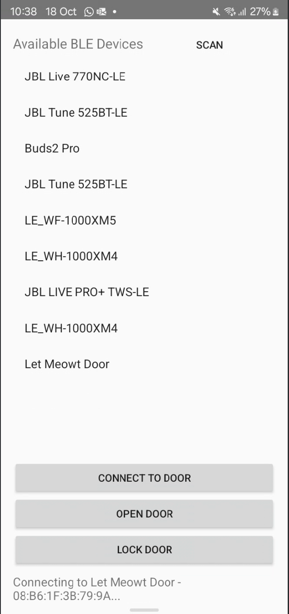

We can see our device name in the list

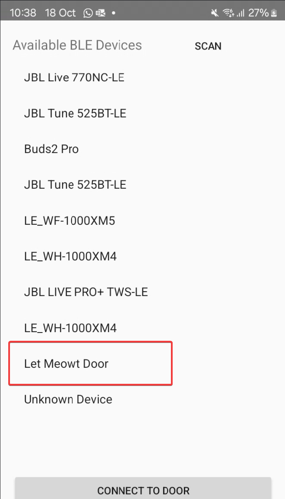

By clicking on it it starts to connect to the device

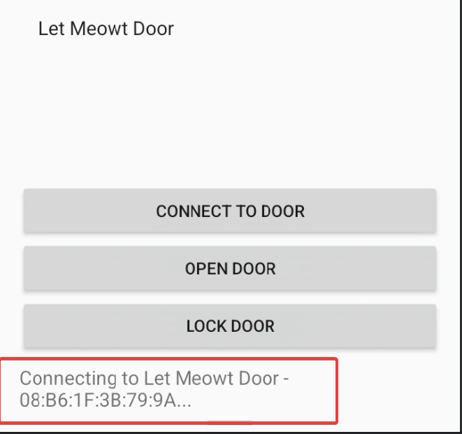

Clicking the "Open Door" or "Close Door" buttons sends data to the ESP

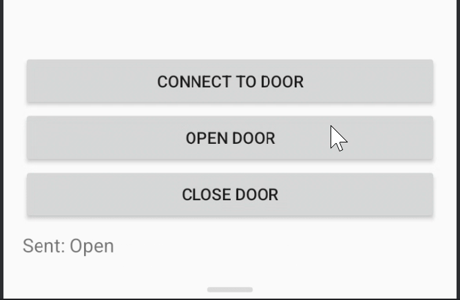
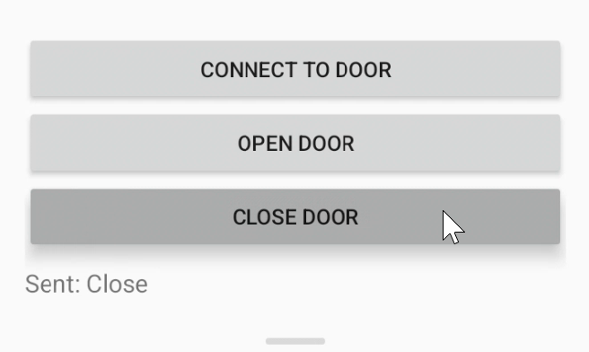

Here you see the data that is recieved in the console  by the ESP

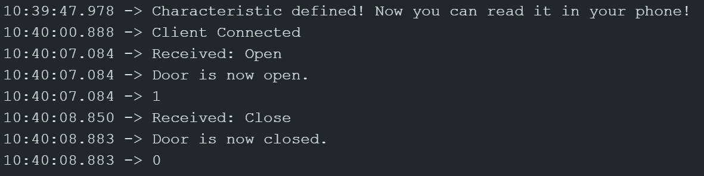
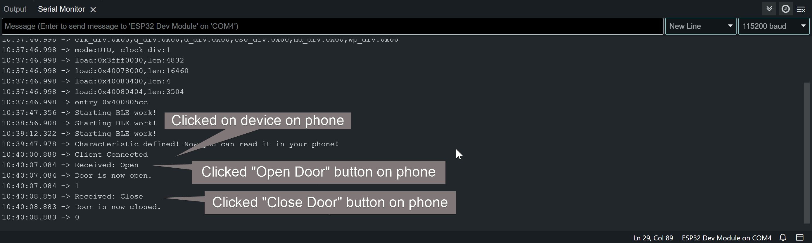


---

## Troubleshooting Guide

#### ESP32 Not Connecting via BLE
   - **Cause**: BLE may not be initialized properly or the device is not discoverable.
   - **Solution**: 
     - Ensure `BLEDevice::init()` is called in the `setup()` function to initialize BLE.
     - If the device fails to connect after disconnection, call `BLEDevice::startAdvertising()` again to re-enable BLE advertising.
     - Verify that the BLE service and characteristic UUIDs match those expected by the Android app.

#### No BLE Devices Found During Scan
   - **Cause**: Insufficient permissions or disabled Bluetooth on the phone.
   - **Solution**: 
     - Ensure that Bluetooth is turned on in the phone’s settings.
     - Check that the app has the necessary permissions:
       - **BLUETOOTH** and **BLUETOOTH_ADMIN** permissions for scanning.
       - **ACCESS_FINE_LOCATION** to access BLE.
     - You can check for missing permissions in the Android log (logcat) and add them in `AndroidManifest.xml`.
     - Ensure that BLE scanning starts after permissions are granted. Use `ActivityCompat.requestPermissions()` if permissions are not granted by default.

#### Android App Crashes on Startup
   - **Cause**: Kotlin dependencies or incorrect configuration in Android Studio.
   - **Solution**: 
     - Make sure the Kotlin Gradle plugin is correctly set up in `build.gradle`.
     - Update dependencies in `build.gradle` (app-level) to ensure the correct versions of `kotlin-stdlib`, `androidx`, and Bluetooth libraries are used.
     - Ensure that you handle all required lifecycle events and runtime permissions.
     - If the crash is related to BLE or permissions, examine the crash log in Android Studio to determine the specific cause (e.g., `NullPointerException` or unhandled BLE callbacks).

#### Commands Not Executing on ESP32
   - **Cause**: The UUIDs for BLE characteristics might be incorrect, or the characteristic callback function isn't set up properly.
   - **Solution**:
     - Double-check the characteristic UUIDs in both the ESP32 and Android code to ensure they match.
     - Ensure that the characteristic write permissions are enabled on the ESP32.
     - The callback function on the ESP32 needs to properly handle the incoming data. For example, the `onWrite()` function should parse and execute the correct command from the Android app.
     - Test the BLE communication using a Bluetooth scanning tool like **nRF Connect** to ensure that the ESP32 is receiving and responding to commands correctly.

#### BLE Connection is Dropping
   - **Cause**: Connection instability due to signal interference or power-saving settings.
   - **Solution**:
     - Ensure the ESP32 is running a stable power supply.
     - Decrease the connection interval or increase the supervision timeout in your BLE configuration on the ESP32 to allow for a more stable connection.
     - Move the Android device closer to the ESP32 to avoid signal interference.
     - Disable any power-saving features on the Android device that might interfere with the BLE connection.

#### ESP32 Device Not Responding to Android App Commands
   - **Cause**: Miscommunication or incorrect setup of the BLE server on the ESP32.
   - **Solution**:
     - Check that the BLE service and characteristic UUIDs in the ESP32 match those in the Android app code.
     - Ensure the ESP32 is correctly parsing and responding to commands sent via BLE. Add debug logs in the ESP32 code to verify that commands are being received.
     - Use a BLE debugging tool like **nRF Connect** to inspect the BLE characteristics and ensure data is being transferred correctly.

#### Failure to Open Bluetooth Settings or Permissions Issues on Android
   - **Cause**: Permissions or Intent handling not implemented correctly.
   - **Solution**:
     - Check that Bluetooth permissions are requested before any BLE operations are started. Use `ActivityCompat.requestPermissions()` in the Android app to prompt the user for permissions.
     - Ensure that the correct `Intent` is being used to open Bluetooth settings when necessary. For example, use `startActivityForResult()` to open the Bluetooth settings page if Bluetooth is disabled.

---

### **Conclusion**

By following this detailed guide, you should now have a fully functioning IoT solution that allows an Android app to control an ESP32 over BLE. We’ve covered every step in detail, ensuring you understand not just the **how**, but the **why** behind each action. Whether you are a beginner or have some experience with coding, this journey has taken you from setting up the development environment to establishing BLE communication and testing the final system.

